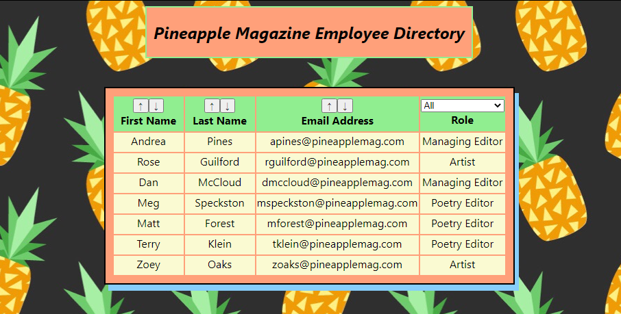

Pineapple Magazine Employee Directory
by Dan McKeon

1. DESCRIPTION

This is an employee directory React app made for an example (fictional) literary magazine, Pineapple Magazine, that allows employees to look up basic information about other employees. The app allows for sorting first name, last name and email address alphabetically as well as filtering out based on the three roles: managing editor, poetry editor, and artist.

2. INSTALLATION

Start by running

- npm install

to install relevant dependencies. This may take a while as React sets up. Use

- npm run

to start the app locally. Access at localhost:3000.

3. DEPENDENCIES

- React
- JSX
- express

4. SCREENSHOTS

  

5. LINKS
GitHub repo: https://github.com/dooski/employee-directory
Deployed application: https://immense-mesa-81928.herokuapp.com/